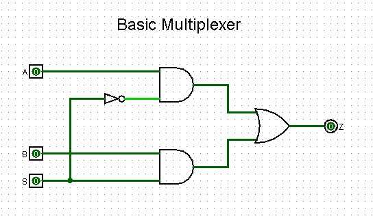
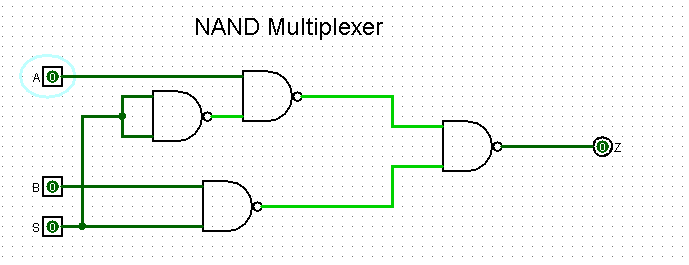

## Truth Table

| First Input (A) | Second Input (B) | Control Signal (S) | Output |
| :--: | :--: | :--: | :--: |
| 0 | 0  | 0 | 0 |
| 0 | 0  | 1 | 0 |
| 0 | 1  | 0 | 0 |
| 0 | 1  | 1 | 1 |
| 1 | 0  | 0 | 1 |
| 1 | 0  | 1 | 0 |
| 1 | 1  | 0 | 1 |
| 1 | 1  | 1 | 1 |

To find the Boolean expression equivalent to the output values, we will use the concept of minimum terms. That is, we will select only positive outputs (1) and form the expression according to the following rule: 

- Input equals zero ➝ Output complemented, otherwise ➝ output equals one. 

### Expression

> 

### Simplification
> 

> 

> 

> 

> 

## Creating Digital Circuit with the AND, OR and NOT gates

First, we will use the basic logical operations: AND, OR and NOT.

Taking into account the universality of the NAND logic gate, we can convert the logic circuit using just this logic operation. 

