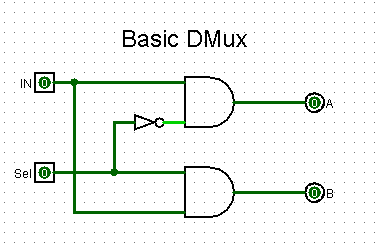
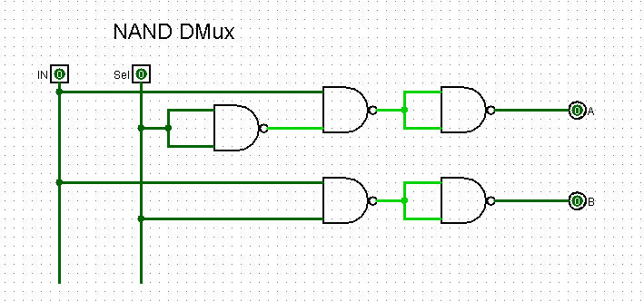

## Truth Table

| Input (In) | Control Signal (Sel) | Output A | Output B |
| :--: | :--: | :--: | :--: |
| 0 | 0  | 0 | 0 |
| 0 | 1  | 0 | 0 |
| 1 | 0  | 1 | 0 |
| 1 | 1  | 0 | 1 |

To find the Boolean expression equivalent to the output values, we will use the concept of minimum terms. That is, we will select only positive outputs (1) and form the expression according to the following rule: 

- Input equals zero ➝ Output complemented, otherwise ➝ output equals one. 

### Expression for A

> 

### Expression for B

> 

## Creating Digital Circuit
_all circuits were made in [logisim](http://www.cburch.com/logisim/) software, version 2.7.1._

First, we will use the basic logical operations: AND, OR and NOT.

just using NAND gates.

