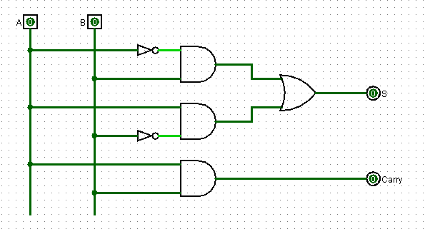
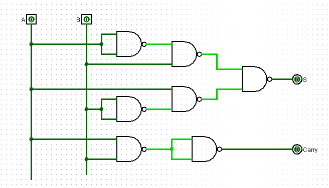
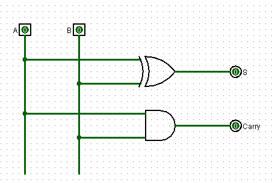

## Half Adder Truth Table

| A | B |  S | Co |
| :--: | :--: | :--: | :--: | 
| 0 | 0  | 0 | 0 | 
| 0 | 1  | 1 | 0 | 
| 1 | 0  | 1 | 0 | 
| 1 | 1  | 0| 1 | 

Computing the Boolean expression, we have:

- Output: (¬A)B + A(¬B)
- Carry: AB

## Creating Digital Circuit
_all circuits were made in [logisim](http://www.cburch.com/logisim/) software, version 2.7.1._

### Circuit with AND, OR and NOT gates.

### Circuit with NAND gates 

### Circuit with XOR gate

