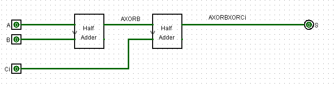
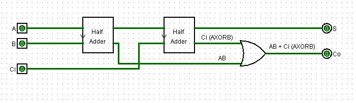
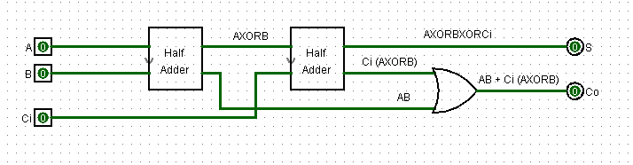

First, it is necessary to evaluate the half-adder and full-adder truth tables. 

## Full Adder Truth Table

| A | B | Ci | S | Co |
| :--: | :--: | :--: | :--: | :--: |
| 0 | 0  | 0 | 0 | 0 |
| 0 | 0  | 1 | 1 | 0 |
| 0 | 1  | 0 | 1 | 0  |
| 0 | 1  | 1 | 0 | 1  |
| 1 | 0  | 0 | 1 | 0  |
| 1 | 0  | 1 | 0 |  1 |
| 1 | 1  | 0 | 0 |  1 |
| 1 | 1  | 1 | 1 |  1 |

## Full Adder Truth Table

| A | B |  S | Co |
| :--: | :--: | :--: | :--: | 
| 0 | 0  | 0 | 0 | 
| 0 | 1  | 1 | 0 | 
| 1 | 0  | 1 | 0 | 
| 1 | 1  | 1| 1 | 

Performing the calculation of boolean expressions, we have that: 

- For half adder, output is A⊕B and carry is AB. 
- For the full adder, output is A⊕B⊕Ci and carry is AB + BCi + ACi. 

In this way, we can build a full adder from half adders. Looking specifically at the output of the full adder, it appears that it is enough to include a carry input in A⊕B, forming A⊕B⊕Ci. As the output of one half adder is A⊕B, we can connect two half adders in sequence, the output of the second being Ci. Thus: Ci ⊕ (A⊕B). 

Now that we've managed to set the output, let's set the carry. Analyzing the output of the carry of the full adder (AB + BCi + ACi), we can manipulate it in order to try to find some relation with the output of the carrys of the half adders.

> 

> 

> 

With this, we have to perform a logical OR operation between the carry of the first half adder and the second.

## Creating Digital Circuit
_all circuits were made in [logisim](http://www.cburch.com/logisim/) software, version 2.7.1._

